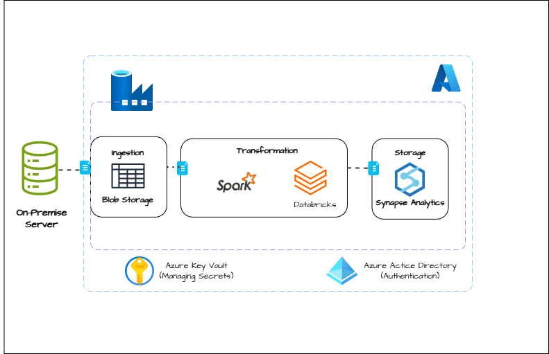

# ShopEase Retail Cloud Migration pipeline

This repository contains the implementation of a data migration pipeline for Shopease, a retail company that needed to migrate their data from a local on-premises environment to Microsoft Azure Cloud. 
The goal of this project was to automate the transfer, transformation, and storage of the company's data to a more scalable and efficient cloud infrastructure. 

## Business Introduction
ShopEase Retail is a medium-sized retail chain offering a wide range of consumer goods, electronics, and household items. With more than 50 locations spread throughout various regions in the United Kingdom, ShopEase is renowned for its focus on customer satisfaction. It seamlessly blends in-store and online shopping to provide top-notch products at competitive prices.

## Problem Statement
ShopEase Retail depends on an outdated on-premise database system for managing essential business data such as sales, inventory, and customer information. The upkeep of this infrastructure demands considerable costs and resources, including hardware updates, manual backups, and continuous server maintenance. Alongside these operational hurdles, the system occasionally suffers from outages, especially during peak traffic times, which hampers the online shopping experience for customers. These disruptions lead to lost sales and a decrease in customer satisfaction.

## Proposed Solution
To stay competitive and improve its business operations, ShopEase must transition to a more scalable, cost-effective, and dependable cloud-based data infrastructure. This move will not only alleviate the maintenance demands of on-premise resources but also enhance data accessibility, allowing advanced analytics to drive business insights and elevate the customer experience.

## Architecture

## Project Workflow
1. Data Extraction from Local Environment
Data was initially stored in the on-premises systems and needed to be extracted for migration.
We used Azure Data Factory (ADF) to connect to the on-premises data sources, including databases, flat files, and other local storage solutions.
ADF pipelines were created to extract data from these sources in incremental batches to avoid downtime during the migration.
2. Data Storage in Azure datalake
Once the data was extracted, it was transferred to Azure storage account.
We used azure storage as the raw data landing zone, where data is stored until it can be processed further.
3. Data Transformation in Azure Databricks
Azure Databricks was used to perform data cleansing and transformation on the extracted data.
The transformation leveraged on Apache Spark on Databricks, which provided scalable compute resources for processing large volumes of data efficiently.
4. Data Loading into Azure Synapse Analytics
After transformation, the processed data was loaded into Azure Synapse Analytics, which served as the central data warehouse.
The data was loaded into structured tables, where it could be queried for business intelligence and analytics.
5. Pipeline Orchestration with Azure Data Factory
Azure Data Factory was used to orchestrate the entire data migration pipeline.
Azure Data Factory pipelines were set up to automate the entire data flow, ensuring seamless data extraction, transfer, transformation, and loading.
The pipelines were scheduled to run at specific intervals to allow continuous data sync between the on-premises environment and the Azure Cloud.

